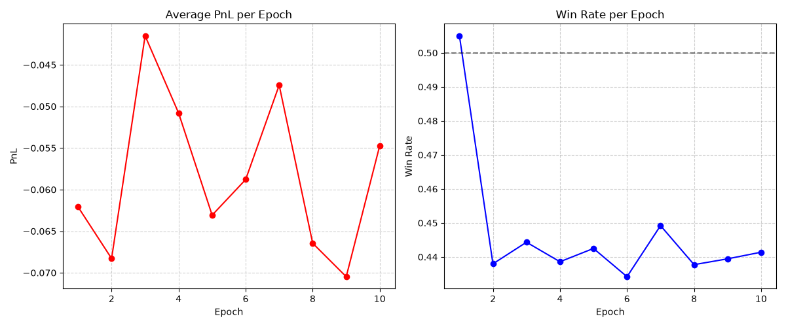

# Quantitative Market Strategy Research (PyTorch GRU + DuckDB ETL)

An R&D quantitative research project focused on testing market predictability and limit-order execution on Binance Perpetual Futures. The project features automated DuckDB data validation, stochastic dataset sampling, custom PyTorch neural architecture, and a fully differentiable simulation of bid/ask limit-order execution.

## 📊 Dataset & Pipeline

The dataset comprises 5 years (2021-2026) of 1-minute OHLCV data for BTC, ETH, SOL, and BNB collected directly from Binance Public Data archives.

* **ETL Engine:** Automated download, zero-copy Parquet compilation, and continuous time-grid validation using **DuckDB**.
* **Data Integrity:** Strict SQL assertions ensuring zero missing minutes (Forward-Fill applied during exchange halts), strictly positive volumes, and valid price extrema ($Low \le Open, Close \le High$).

## 🛠 Tech Stack

* **Deep Learning:** PyTorch (`nn.GRU`, custom differentiable PnL engine)
* **Data Engineering:** DuckDB, Parquet, Pandas, NumPy
* **Visualization & Utilities:** Matplotlib, tqdm

## 🧠 Methodology & Strategy Design

1. **Trading Strategy:**
The model predicts simultaneous **Buy (Bid)** and **Sell (Ask)** limit order offsets around the current price based on dynamic volatility scaling ($\sigma$). The execution engine accounts for order patience, maker/taker fees, and high/low candle overlap.
2. **Full Stochastic Sampling:**
To prevent regime overfitting, each batch element dynamically samples:
* **Random Asset:** Selected from available futures contracts.
* **Random Timeframe Resampling:** Reshaped candles between 1 hour and 8 hours.
* **Dynamic Context Window:** Sequence history between 10 and 30 frames.

3. **Differentiable PnL Engine:**
Implemented via `.detach()` in PyTorch to bypass non-differentiable order-trigger boundary conditions, allowing the neural network to backpropagate gradients directly through simulated trading PnL.

## 📈 Key Findings & Fractal Noise Hypothesis



* **Results:** Across dynamic timeframes and assets, average PnL remains negative with a Win Rate oscillating around ~44%.
* **Conclusion (Fractal Noise Hypothesis):**
Despite stochastic cross-asset sampling and dynamic timeframe resampling, the model fails to extract a profitable edge. This demonstrates that the **fractal nature of financial markets effectively scales the underlying noise across all timeframes**. Strategy execution on purely technical/OHLC features faces the same efficiency barrier whether evaluated on 1-hour or multi-hour windows once exchange fees are applied.

## 🚀 Quick Start

**1. Install dependencies:**

```bash
pip install -r requirements.txt

```

**2. Run the DuckDB ETL Pipeline:**
Downloads 5 years of Binance UM Futures data, forward-fills missing gaps, and compiles it into zero-copy Parquet files.

```bash
python src/data_pipeline.py

```

**3. Train the Model:**
Executes the PyTorch training loop with the differentiable limit-order simulation. Artifacts (weights and charts) are saved to the `results/` folder.

```bash
python train.py

```
